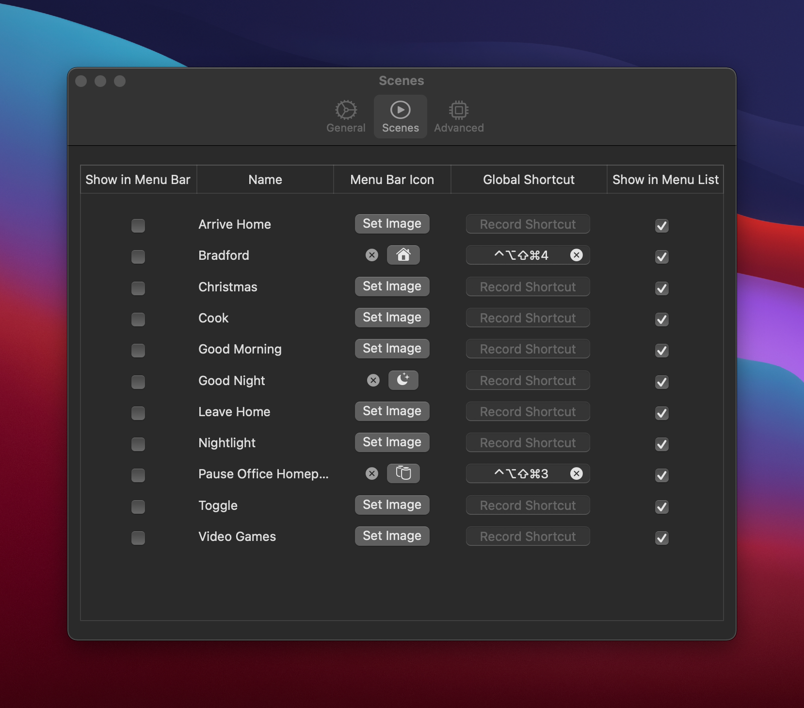
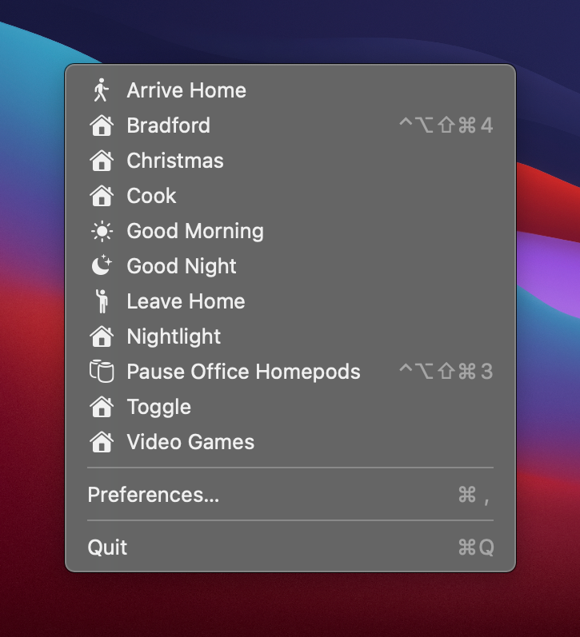

# Scenecuts

A simple menubar app to trigger HomeKit scenes. Huge shoutout to [@steventroughtonsmith](https://github.com/steventroughtonsmith) and his sample project [airqualitymonitor](https://github.com/steventroughtonsmith/airqualitymonitor) for the inspiration and showing how to create a menubar application for controlling Homekit.

## Installation

You need to install and run both the main app and the helper app. [Download Here](https://github.com/nehayward/Scenecuts/releases/download/2020.1/Scenecuts.zip)

*macOS Big Sur required

## Screenshots

